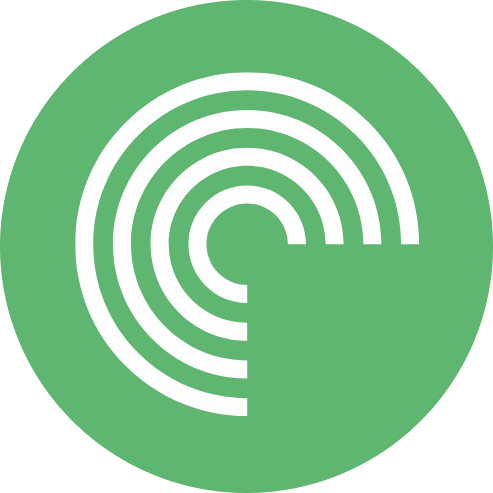
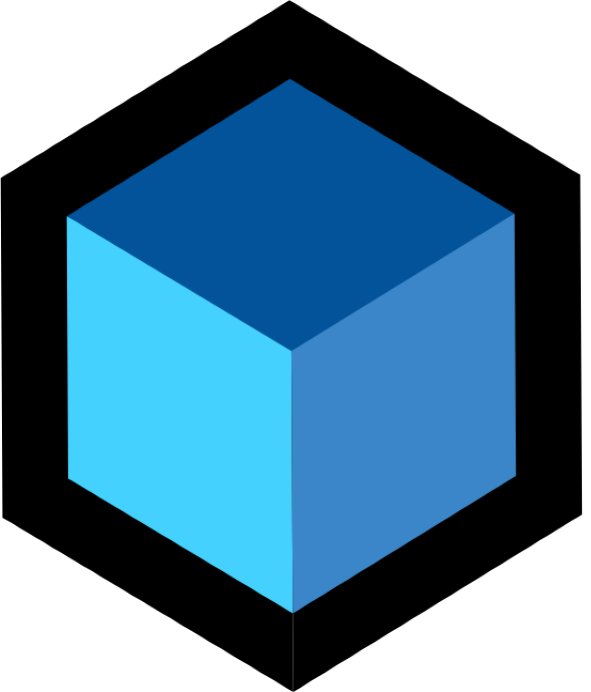
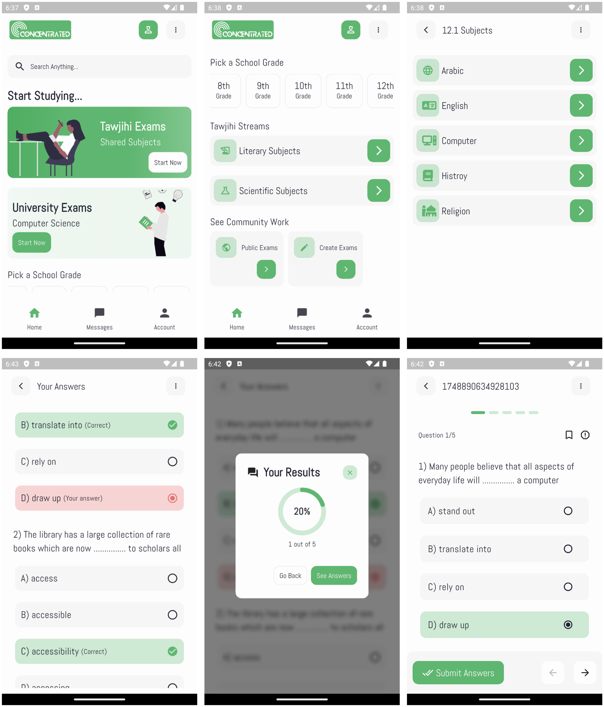

###

  
  
  
  
  
  
  

###

  
  
  

###

 

<h1 align="center">Concentrated</h1>

  

###

<h2 align="left">🟢 Introduction</h2>

Concentrated is a cross-platform mobile application for taking and creating exams and quizzes. The project focuses on showcasing clean-architecture, MVVM, and SOLID principles in Flutter.

###

<h2 align="left">🟢 Screenshots</h2>

###

<h2 align="left">🟢 Key Features</h2>

• Exam Creation: Create exams and quizzes with multiple-choice questions. • Exam Taking: Take exams and quizzes. • Exam Results: View exam results and statistics. • Exam Management: Manage exams and quizzes. • Exam Tracking: Track exam results and statistics.

###

<h2 align="left">🟢 Tech Stack</h2>

• Frontend: Flutter. • Backend: Firebase (Firestore, Authentication).

###

<h2 align="left">🟢 Project Status</h2>

###

• Ongoing

###

<h2 align="left">🟢 Contact</h2>

• Email: yahya.amarneh73@gmail.com

